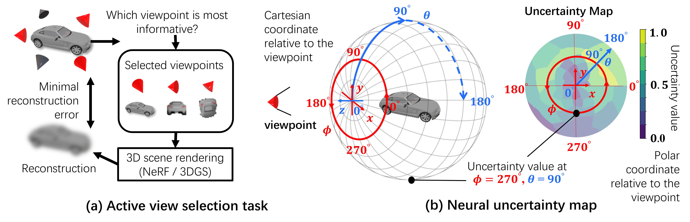
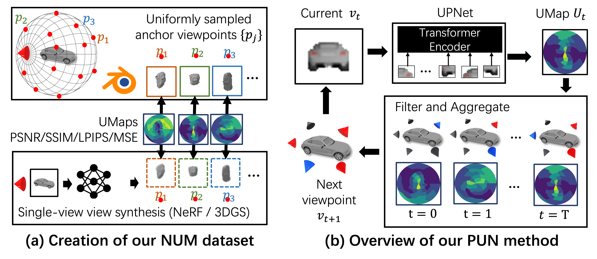
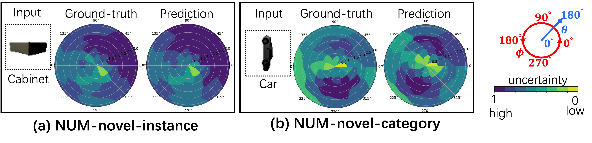

# Peering into the Unknown: Active View Selection with Neural Uncertainty Maps for 3D Reconstruction

This repository provides the **official implementation** of **_Peering into the Unknown: Active View Selection with Neural Uncertainty Maps for 3D Reconstruction_**.

## [Paper](https://arxiv.org/abs/2506.14856v2) | [Dataset](https://drive.google.com/drive/folders/1LNXUIZFjTFLSvLw81ibHI2YvHdpLshlD?usp=share_link) | [Models](https://drive.google.com/drive/folders/1SmAq_RmEDKGDYT-rVy7YBnEmewmOBIRW?usp=share_link) | [Poster](https://drive.google.com/file/d/1qA3WS7Z3KPYxNYwlfsfKqLNi5yddjg9Q/view?usp=share_link) | Presentation *(coming soon)*


## Abstract
Imagine trying to understand the shape of a teapot by viewing it from the front—you might see the spout, but completely miss the handle. Some perspectives naturally provide more information than others. How can an AI system determine which viewpoint offers the most valuable insight for accurate and efficient 3D object reconstruction? Active view selection (AVS) for 3D reconstruction remains a fundamental challenge in computer vision. The aim is to identify the minimal set of views that yields the most accurate 3D reconstruction.
Instead of learning radiance fields, like NeRF or 3D Gaussian Splatting, from a current observation and computing uncertainty for each candidate viewpoint, we introduce a novel AVS approach guided by neural uncertainty maps predicted by a lightweight feedforward deep neural network, named UPNet. 
UPNet takes a single input image of a 3D object and outputs a predicted uncertainty map, representing uncertainty values across all possible candidate viewpoints. By leveraging heuristics derived from observing many natural objects and their associated uncertainty patterns, we train UPNet to learn a direct mapping from viewpoint appearance to uncertainty in the underlying volumetric representations. 
Next, our approach aggregates all previously predicted neural uncertainty maps to suppress redundant candidate viewpoints and effectively select the most informative one. Using these selected viewpoints, we train 3D neural rendering models and evaluate the quality of novel view synthesis against other competitive AVS methods. Remarkably, despite using half of the viewpoints than the upper bound, our method achieves comparable reconstruction accuracy. In addition, it significantly reduces computational overhead during AVS, achieving up to a 400 times speedup along with over 50\% reductions in CPU, RAM, and GPU usage compared to baseline methods. Notably, our approach generalizes effectively to AVS tasks involving novel object categories, without requiring any additional training. 
<div align=left></div>  

## Dataset

The following datasets are used in our experiments:

- **[ShapeNet](https://shapenet.org)** (Download it and place it at /path/to/ShapeNet)
- **NeRF Synthetic Dataset** (data/assets/blend_files)
- **[Neural Uncertainty Map (NUM) Dataset](https://drive.google.com/drive/folders/1Eki_n8Tk2Y-52_zRSOphTPdJD2ESd8Hl?usp=sharing)** (Download it and place it at /path/to/NUM)

<div align=left></div>  

To generate NUM dataset from scratch:
1. please follow the installation instructions of [splatter-image](https://github.com/szymanowiczs/splatter-image).
2. replace `shapenet_path` and `output_path` in `fep_nbv/uncertainty_map_generation/single_rotation_generation.py` with `/path/to/ShapeNet` and `/path/to/NUM`.
3. replace `shapenet_path` and `output_path` in `fep_nbv/uncertainty_map_generation/parralized_distribution_generation_splited_shapenet.py`  with `/path/to/ShapeNet` and `/path/to/NUM`. Adjust `included_category` in `fep_nbv/uncertainty_map_generation/parralized_distribution_generation_splited_shapenet.py` to specify which object categories to process.
4. Update `server_config.json` to match your computing environment.
5. run 
```bash
python fep_nbv/uncertainty_map_generation/parralized_distribution_generation_splited_shapenet.py
```

## Installation

### Dependencies

This repository depends on **NVF**, **Splatter-image** and **Nerfstudio**.  
Please follow the official NVF installation instructions:

1. install [nvf](https://github.com/GaTech-RL2/nvf_cvpr24.git).

2. install other dependency.
    pip install -r requirements.txt

3. install [splatter-image](https://github.com/szymanowiczs/splatter-image) to generate the NUM dataset locally.

> Refer to the NVF repository for detailed setup instructions of both **NVF** and **Nerfstudio**.

### Tested Environment

The code has been tested under the following environment:

- **GPU**: NVIDIA GTX 3090
- **PyTorch**: 2.0.1
- **CUDA**: 11.7
- **Operating System**: Ubuntu 20.04
- **python**: 3.10

Other configurations may work but are not guaranteed.

---

## Usage

### Inference

To run NBV inference with a trained model:

```bash
python fep_nbv/baseline/our_policy_single.py --vit_ckpt_path vit_small_patch16_224_PSNR_250425172703 --model_3d_path <PATH_TO_ShapeNet>/<category>/<instance index> # some instance example in data/instance_example
python fep_nbv/baseline/our_policy_single.py --vit_ckpt_path vit_small_patch16_224_PSNR_250425172703 --model_3d_path data/shapenet/instance_example/02691156/1a04e3eab45ca15dd86060f189eb133
```

To train a UPNet using NUM dataset, download the **[Neural Uncertainty Map (NUM) Dataset](https://drive.google.com/drive/folders/1Eki_n8Tk2Y-52_zRSOphTPdJD2ESd8Hl?usp=sharing)** dataset and put it in data/NUM_example.
```bash
cd 08-vit-train
python test_train.py --vit_used vit_small_patch16_224 --epochs 100 --batch_size 32 --lr 1e-4 --uncertainty_mode PSNR --dataset_path data/NUM_example
```

### visualization
To visualize the uncertain map predicted by UPNet
1. adjust `NUM_path` and `model_path` in `08-vit-train/visualize_predicted_uncertainty.py`.
2. run
```bash
cd 08-vit-train
python visualize_predicted_uncertainty.py
```
<div align=left></div>  


## BibTeX
```
@article{zhang2025peering,
  title={Peering into the Unknown: Active View Selection with Neural Uncertainty Maps for 3D Reconstruction},
  author={Zhang, Zhengquan and Xu, Feng and Zhang, Mengmi},
  journal={arXiv preprint arXiv:2506.14856},
  year={2025}
}
```


## Acknowledgments
We benefit a lot from [nvf](https://github.com/GaTech-RL2/nvf_cvpr24.git) and [splatter-image](https://github.com/szymanowiczs/splatter-image) repo.
